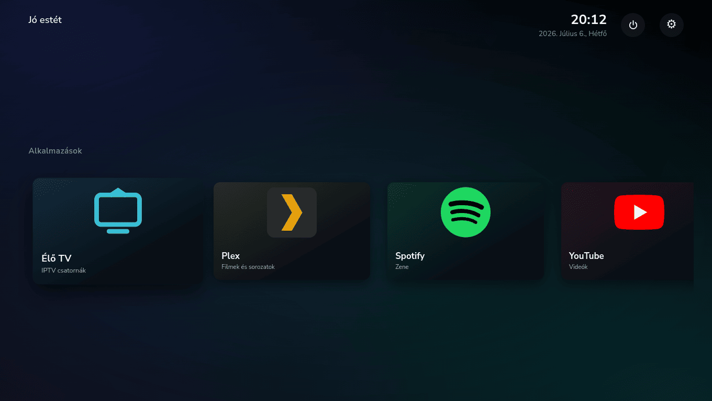
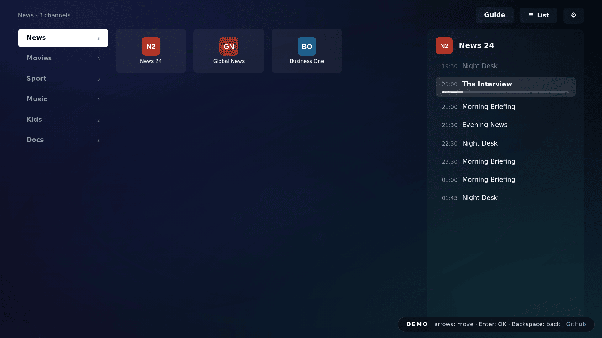
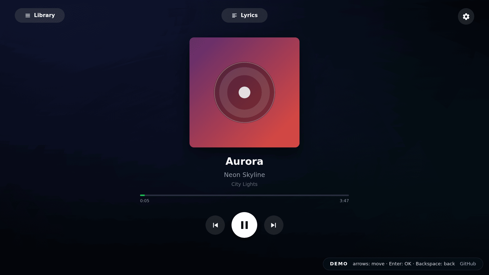

# tvbox

A FireTV-style TV box for the **Raspberry Pi 5**: a clean, remote-driven home
screen that replaces Kodi/Android TV with a fullscreen web launcher and native
`mpv` playback. It boots straight into a 10-foot UI you drive entirely with the
TV remote over HDMI-CEC. Native ARM, no emulation.

Apps are **self-contained packages** installed from a **curated registry** (the
Kodi model). The box ships a launcher plus an SDK (`@tvbox/app-sdk`); each app
brings its own 10-foot UI and, where it needs one, a host-side plugin. A fresh
box starts empty: HOME shows a "Get more apps" tile and you install what you
want from the TV. Nothing comes bundled.

|                            |                                                                                                   |
| -------------------------- | ------------------------------------------------------------------------------------------------- |
| 📺 **Fullscreen launcher** | React/TypeScript, D-pad spatial navigation, i18n (English + Hungarian)                            |
| 🎬 **Real video**          | `mpv` for IPTV and Plex, composited behind the UI                                                 |
| 🕹️ **TV remote only**      | HDMI-CEC via a uinput bridge, no keyboard or phone for day-to-day use                             |
| 🧩 **Package apps**        | self-contained, installed from a curated registry, versioned and updated independently of the box |
| 🎧 **Spotify Connect**     | with the Spotify app installed, the box is a cast target                                          |
| 🔒 **No cloud**            | everything runs on the Pi; credentials stay in `~/.tvbox` (`chmod 600`)                           |

## Try it in your browser

**[▶ Live demo](https://andy1210.github.io/tvbox/)** runs the real launcher
against a mocked box, so you can feel the UI without installing anything: HOME,
all of Settings, the App Store (browse, app detail, "What's new" changelog) and
the Ambient screen. Apps open in their own window on a real box, so the demo is
the shell only. Drive it with the keyboard: **arrow keys** = D-pad, **Enter** =
OK, **Backspace** = Back.

HOME on a real box (Raspberry Pi 5, driven by the TV remote):



Live TV's channel browser with EPG, and the Spotify Now Playing screen (both are
app packages, shown running on a real box):

<p>
  
  
</p>

## How it works

```
   TV remote ──HDMI-CEC──▶ cec_uinput_bridge (user service, /dev/uinput) ──▶ Wayland key events
                                                                          │
   ┌──────────────────────────────────────────────────────────────────────▼─────────┐
   │ Electron shell (fullscreen, always-on-top, Wayland)                              │
   │   • HTTP server on :8097 serves the launcher + app bundles + a small JSON API    │
   │   • app-package registry + install runner (~/.tvbox/apps/<id>/)                  │
   │   • mpv control (video plays BEHIND the transparent window)                      │
   │   • capability-scoped preload bridge per app                                     │
   │   • plugin loader (host-side plugin.js shipped inside an app package)            │
   └───────┬───────────────────────────┬──────────────────────────────┬──────────────┘
           │ serves /tvbox/            │ launches                      │ composites over
           ▼                           ▼                               ▼
   HOME launcher (React)      web-client / remote apps            mpv (fullscreen / overlay)
```

| Component                  | Role                                                                                                                                                                             |
| -------------------------- | -------------------------------------------------------------------------------------------------------------------------------------------------------------------------------- |
| **[shell/](shell/)**       | Electron host: HTTP server, app-package registry + installer, `mpv` control, window/nav, capability-scoped `preload` bridge, plugin loader. ([shell/README.md](shell/README.md)) |
| **[launcher/](launcher/)** | React 10-foot HOME screen, remote-driven via spatial navigation, built into the shell. ([launcher/README.md](launcher/README.md))                                                |
| **[cec/](cec/)**           | `cec_uinput_bridge.py`: turns CEC keypresses into Linux input events (the `tvbox-cec` systemd **user** service).                                                                 |
| **[deploy/](deploy/)**     | one-shot provision + deploy script and the session autostart.                                                                                                                    |

An installed app lives in `~/.tvbox/apps/<id>/` as a manifest, a `web/` UI
bundle, and (where needed) a host-side `plugin.js`. The launcher draws a tile
per app; the shell launches each one, either as a local bundle composited over
`mpv` or as a remote smart-TV site in a sandboxed window. Details in
[Getting apps](#getting-apps) and [Adding an app](#adding-an-app).

## Hardware and OS

- **Raspberry Pi 5** (aarch64). A Pi 4 may work but is untested.
- **Raspberry Pi OS (Debian trixie)** with a **labwc/Wayland** session and
  autologin. The shell is a Wayland client and expects a compositor at login.
- A TV with **HDMI-CEC** for the remote (LG SIMPLINK, Samsung Anynet+, Sony
  Bravia Sync, etc.). Enable it in the TV's settings.

> CEC quirks vary by TV. Some sets can't tell Back from Exit, so **Home is a
> double-tap of Back**. See [The remote](#the-remote).

## Install

Two paths onto a Pi 5: flash the SD image (no dev machine at all), or a manual
install over SSH (`deploy.sh`, which is also the dev iteration loop).

### Option A: flash the SD image

The LibreELEC-style path: **flash, boot, the TV shows the launcher.**

1. Download the latest `tvbox-*.img.xz` from
   [Releases](https://github.com/Andy1210/tvbox/releases), or build one yourself
   ([docs/sd-image.md](docs/sd-image.md), locally or via the `sd-image` Action).
2. Flash with **Raspberry Pi Imager** ("Use custom image") or `dd`/balenaEtcher
   to a good SD card (A2-class recommended).
3. Plug the Pi into the TV over HDMI and power on. First boot takes a minute
   longer (filesystem expansion), then the launcher appears.

What the image gives you:

- **Boots to the launcher.** Fixed `tv` user, locked password, greetd
  autologin. No keyboard, wizard or login screen anywhere.
- **No apps preinstalled.** HOME shows "Get more apps"; you install from the
  registry ([Getting apps](#getting-apps)). Only the shared media stack (`mpv` +
  audio libs) ships in the image.
- **Network.** Ethernet works immediately. WiFi is set up from the TV (Settings
  → Network); the image brings the radio up and sets the WiFi country so it
  scans out of the box.
- **First-boot setup with one file.** Drop a `tvbox.conf` on the boot (FAT)
  partition to name the box, join WiFi, add your SSH key, and more - all
  optional, all in one place (there's a click-together generator under
  [`docs/config/`](docs/config/)):

  ```sh
  HOSTNAME=living-room
  WIFI_SSID=MyNetwork
  WIFI_PASSWORD=secret        # omit for open
  SUDO=true                   # passwordless sudo over SSH for power users
  SSH_AUTHORIZED_KEY=ssh-ed25519 AAAA... you@host
  ```

  The `tv` account is password-locked, so an **SSH key** is how you get in
  (`ssh tv@<box-ip>`); `SUDO=true` is an opt-in power-user affordance (a normal
  box has no sudo - the app always runs rootless). See
  [docs/sd-image.md](docs/sd-image.md) for every key. The hostname is also
  editable later on the TV (Settings → General → Device name).

- **Self-updating.** OTA app/box updates from the releases feed, plus OS
  security updates, both without ever auto-rebooting.

Preseed steps and details: [docs/sd-image.md](docs/sd-image.md#notes).
Raspberry Pi Imager "OS customisation" and `custom.toml` do **not** work on a
custom image, which is why the box ships its own boot-partition preseed.

### Option B: manual install onto Raspberry Pi OS (deploy.sh)

On the Pi, once: flash **Raspberry Pi OS**, boot to a **labwc/Wayland desktop
with autologin**, and make sure you can SSH in from your dev machine.

From a checkout on your dev machine (needs Node + `rsync` + `ssh`):

```sh
./deploy/deploy.sh <pi-ssh-host>      # e.g. ./deploy/deploy.sh pi@raspberrypi.local
```

`deploy.sh` is idempotent and installs only a baseline:

- builds the React launcher and syncs `shell/` to `~/.tvbox/shell`;
- runs the **one root step**, `provision.sh` (asks for the sudo password once):
  baseline apt packages, the shared media stack (`mpv` + `libpulse0` +
  `libasound2t64`), and the udev/polkit grants that make everything else
  root-free. App-specific binaries and bundles are **not** preinstalled;
- installs the **CEC to uinput** bridge as the `tvbox-cec` systemd **user**
  service (device access via the udev rule + groups, not root);
- writes the **labwc autostart** so the Pi boots straight into the shell.

After provision, nothing on the box runs as root: the shell, the CEC bridge,
bundle installs (`flatpak --user`) and settings (audio, display, WiFi via a
polkit grant, reboot/poweroff via logind) are all plain user operations. The
script prints a PASS/FAIL summary and exits non-zero on a hard failure. Then:

```sh
sudo reboot        # boots into the tvbox shell
```

On first boot HOME is empty with a "Get more apps" tile. From here the box keeps
itself updated over the air ([Updates and backup](#updates-and-backup)); re-run
`deploy.sh` only when developing.

### Getting apps

Apps live in the **[tvbox-apps registry](https://github.com/Andy1210/tvbox-apps)**
and install from the box: HOME → "Get more apps" (or Settings → App Store). A
flashed box starts empty; an OTA-updated box keeps the apps it already had.
Because only the shared media stack ships, apps install their own
binaries/bundles from the UI, no CLI needed:

- **Binary deps.** An app whose binary ships as a prebuilt `requires.download`
  static build (e.g. Spotify's `librespot`) installs from the TV: select the
  greyed tile and the box fetches + sha256-verifies the binary into
  `~/.tvbox/bin`, no root. Same from the CLI: `tvbox deps <id>` (which also
  handles the rare `requires.apt` dep, the one step that asks for sudo).
- **App bundles.** An app like Plex (a flatpak) installs from the UI: select the
  tile and the box fetches the bundle (`flatpak --user`, no root); the tile
  shows _Installing..._ then becomes launchable. Same from the CLI:
  `tvbox install <id>`.

## Apps

The curated first-party packages in the
[registry](https://github.com/Andy1210/tvbox-apps), all installed from the TV,
none bundled:

| App         | Kind                     | Notes                                                                                                                                                                                                                                                                  |
| ----------- | ------------------------ | ---------------------------------------------------------------------------------------------------------------------------------------------------------------------------------------------------------------------------------------------------------------------- |
| **Live TV** | local package (+ plugin) | IPTV via **Xtream Codes** or an **M3U** playlist + XMLTV guide, played through `mpv`. Ships its own UI plus a host plugin for the IPTV data. Configure on the TV or by scanning a QR with your phone.                                                                  |
| **Plex**    | static web bundle        | The official **Plex HTPC** 10-foot UI, self-hosted from its flatpak bundle and backed by `mpv` through a QWebChannel bridge shim. Login via `plex.tv/link` (no typing).                                                                                                |
| **YouTube** | remote                   | Loads `youtube.com/tv` (leanback UI) with a smart-TV user-agent; D-pad native.                                                                                                                                                                                         |
| **Spotify** | local package (+ plugin) | A **Spotify Connect** speaker via `librespot` (a no-root download dep). Ships its own UI plus a host plugin for the Connect daemon. Optional account features (Liked Songs, search, playlists) need free API keys, see [docs/spotify-setup.md](docs/spotify-setup.md). |

## The remote

The TV remote reaches the box over HDMI-CEC; the bridge maps it to keys the
launcher and apps understand:

| Button                     | Action                                           |
| -------------------------- | ------------------------------------------------ |
| ▲ ▼ ◀ ▶                    | Move focus                                       |
| OK                         | Select                                           |
| Back                       | Back / stop                                      |
| **Home**                   | **Double-tap Back**: return to HOME from any app |
| Play / Pause / Stop / Skip | Transport controls in the active player          |

For text entry (search, IPTV setup) the launcher shows an on-screen keyboard.
Long values (URLs, API keys) can be entered by **scanning a QR with your phone**
and typing there instead of on the TV.

## The App Store

**Settings → App Store** (also HOME → "Get more apps") lists apps from the
[tvbox-apps registry](https://github.com/Andy1210/tvbox-apps): a curated git
repo that CI compiles into one `index.json`, which every box fetches over HTTPS.
Selecting an app opens a full-screen detail view (description, version, "What's
new" changelog); installing fetches the whole package (manifest + `web/` UI +
any `plugin.js`) into `~/.tvbox/apps/<id>/`, each file sha256-verified, and the
tile appears immediately. Self-hosted apps (e.g. Jellyfin) get a "Set address"
step.

Apps **version and update themselves independently of the box.** The store shows
each installed app's version and an "Update available" affordance; merging a new
version into the registry is the rollout, no box release needed.

**Trust is the review, not a code ban.** Every app is merge-reviewed, and that
review is the trust boundary (like Kodi's official repo). A vetted package may
carry a host `service` plugin, its own web UI, and no-root `requires.download`
binaries. The one hard line is **no third-party root apt source**
(`requires.aptRepo` is forbidden). Sandboxed **remote** apps are additionally
confined by **capabilities**: video through the shared `mpv` (`player`),
origin-locked server-side `fetch`, per-app `storage`. The model is in
[docs/capabilities.md](docs/capabilities.md); trust rules and submission in the
[tvbox-apps README](https://github.com/Andy1210/tvbox-apps#readme) and
[AUTHORING.md](https://github.com/Andy1210/tvbox-apps/blob/main/AUTHORING.md).
Self-hosters can point the box at their own registry via `~/.tvbox/config.json`
(`store.registry`).

## Adding an app

An app is a **package**. The full authoring guide (layout, manifest reference,
the web UI via `@tvbox/app-sdk`, the host plugin API, dependencies, versioning)
is
[AUTHORING.md](https://github.com/Andy1210/tvbox-apps/blob/main/AUTHORING.md) in
the registry; the manifest field reference is
[docs/app-manifest.md](docs/app-manifest.md) (schema:
[docs/app-manifest.schema.json](docs/app-manifest.schema.json)).

To publish for everyone, open a PR against the
[registry](https://github.com/Andy1210/tvbox-apps). For a **private** app, drop
a package into `~/.tvbox/apps/<id>/` (or a bare `~/.tvbox/apps/<id>.json`
manifest) on the box; it survives deploys and appears on HOME live, no restart:

```jsonc
{
  "id": "jellyfin",
  "name": "Jellyfin",
  "type": "webclient", // the only type: apps are web packages the shell serves/loads
  "status": "ready",
  "accent": "#00a4dc",
  "icon": "<svg .../>", // inline SVG, rendered sandboxed
  "tagline": { "en": "Movies & TV", "hu": "Filmek és sorozatok" },
  "requires": { "bin": ["mpv"], "apt": ["mpv"] }, // runtime deps; the tile greys out if missing
  "runtime": {
    "serve": "remote", // local bundle | static bundle | remote site
    "url": "https://your.jellyfin/web/",
    "capabilities": ["nav"], // the security boundary: what the preload bridge exposes
  },
}
```

- `requires.bin` is resolved on `PATH`; a missing binary greys the tile and
  labels it "needs X" instead of failing silently.
- `capabilities` is the security boundary: an app only gets the bridge surface
  it declares (default: navigation only).
- An app that needs host-side logic (a daemon, an OAuth window, custom routes)
  sets a `"service"` and ships a `plugin.js` inside the package
  (`apps/<id>/plugin.js`). The host plugin API is in
  [AUTHORING.md](https://github.com/Andy1210/tvbox-apps/blob/main/AUTHORING.md#the-host-plugin).

The `tvbox` CLI on the Pi provisions apps, binary deps separately from
user-space bundles:

```sh
tvbox list                 # apps + install status
tvbox deps <id>            # binary deps (download: no root; apt: one sudo)
tvbox install <id> [-f]    # fetch a bundle (flatpak --user / url / git; -f reinstalls)
tvbox remove <id>
```

## Configuration and data

Everything box-local lives under `~/.tvbox/` (never committed):

| Path                                      | What                                                           |
| ----------------------------------------- | -------------------------------------------------------------- |
| `~/.tvbox/config.json`                    | IPTV source, parental PIN (hashed), Spotify keys (`chmod 600`) |
| `~/.tvbox/spotify-accounts.json`          | Spotify refresh tokens (`chmod 600`)                           |
| `~/.tvbox/shell/`                         | the deployed Electron shell (dev tree)                         |
| `~/.tvbox/versions/` + `~/.tvbox/current` | OTA-installed releases + the active-release symlink            |
| `~/.tvbox/apps/<id>/`                     | installed app packages (manifest + `web/` UI + `plugin.js`)    |
| `~/.tvbox/shell/apps-data/<id>/`          | fetched web bundles for `static` apps (e.g. Plex)              |
| `~/.tvbox/bin/`                           | user-space app binaries from `requires.download` (on PATH)     |

Config is edited from the TV (Settings) or by scanning a QR and filling a form
on your phone. The phone form is on your LAN only and is gated by a code shown
on the TV, so run pairing on a trusted network.

Ports: **8097** (shell HTTP, `127.0.0.1`) and **8099** (on-demand phone-pairing
server, LAN, only while pairing).

## Updates and backup

The box keeps itself current and never reboots or interrupts playback on its own
([docs/updates-and-backup.md](docs/updates-and-backup.md) has the full story):

- **tvbox OTA.** Settings → System & updates checks a release feed daily,
  installs overnight when idle (toggleable), and auto-rolls-back a release that
  doesn't boot. Publishing is tagging `v<version>` (CI attaches the tarball +
  `update.json` to the Release). `tvbox update` from SSH.
- **OS.** `unattended-upgrades` installs security + Raspberry Pi OS updates in
  the background with `Automatic-Reboot "false"`; when a reboot would help,
  Settings shows a hint and a button, on your timing.
- **App bundles.** A nightly user-scope `flatpak update` timer.
- **Backup/restore.** Settings → System & updates → QR: your phone downloads a
  password-encrypted `.tvbackup` (channels, accounts, layout) and can restore it
  later, even onto a re-flashed box.

## Development

**Launcher** (React/TS/Vite/Tailwind):

```sh
cd launcher
npm install
npm run demo        # dev WITHOUT a box: dev server + HMR against the fully mocked shell
npm run dev         # dev server against a real box via TVBOX_HOST (see launcher/README.md)
npm run typecheck   # tsc --noEmit
npm test            # vitest
npm run build       # -> ../shell/launcher-dist (served by the shell)
npm run build:demo  # -> dist-demo (the browser demo published to GitHub Pages)
```

No TV needed for UI work. `npm run demo` runs every launcher screen against the
demo mocks; `TVBOX_HOST=127.0.0.1:8097 npm run dev` (after
`ssh -N -L 8097:127.0.0.1:8097 <pi-ssh-host>`) proxies a real box's API for live
data. See [launcher/README.md](launcher/README.md).

**Shell** (Electron), normally run via the deployed session, but locally:

```sh
cd shell
npm install
npm start           # electron . (expects a Wayland session)
```

`deploy.sh` runs the launcher build before syncing, so a normal deploy is the
full build + install in one command.

## Repo layout

```
tvbox/
  shell/         Electron host (HTTP server, app-package registry + installer, mpv, plugin loader) + preload bridges
    bridges/     renderer bridge adapters (e.g. QWebChannel for Plex)
  app-sdk/       @tvbox/app-sdk, the shared 10-foot UI SDK the launcher + every app package consume
  launcher/      React 10-foot HOME screen (built into the shell)
  cec/           HDMI-CEC to uinput remote bridge (tvbox-cec systemd service)
  deploy/        one-shot provision + deploy script, labwc autostart
  docs/          setup guides (Spotify, etc.) + screenshots
```

## Status

Actively developed for a Raspberry Pi 5 + labwc/Wayland target. CEC behaviour
and IPTV/codec tuning are TV- and provider-specific; the defaults here are
chosen for broad compatibility (e.g. `mpv --vo=gpu --gpu-api=opengl`, software
H.264 decode on the Pi 5, which has no H.264 hardware decoder).

## License

[MIT](LICENSE). Bring your own IPTV/Plex/Spotify accounts and content; this
project ships no media, credentials, or keys.

```

```
