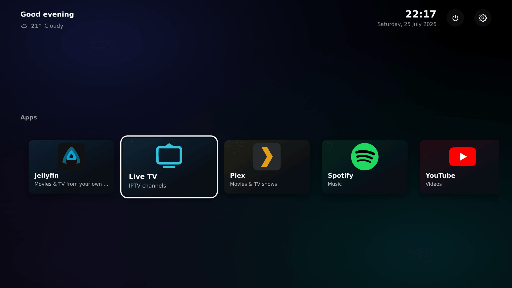
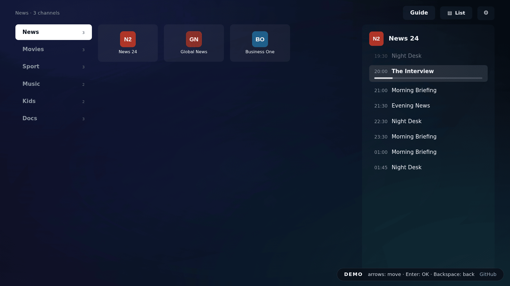
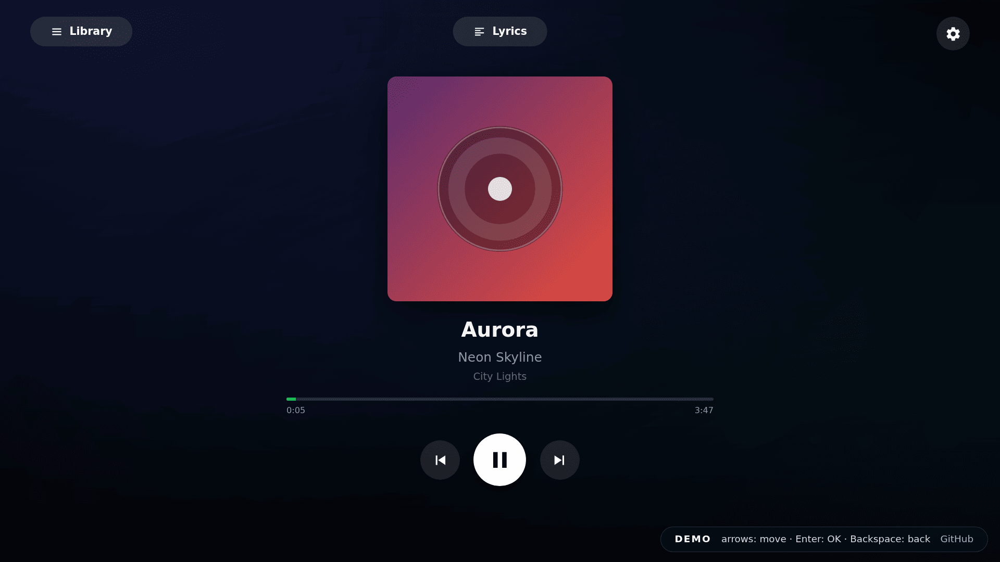

# tvbox

A FireTV-style TV box for the **Raspberry Pi 5**: a clean, remote-driven home
screen instead of Kodi or Android TV. It boots straight into a 10-foot UI you
drive with the TV remote over HDMI-CEC, and plays video natively through `mpv`.
ARM all the way down, no Android layer, nothing in the cloud.

Apps are **self-contained packages** installed from a **curated registry** (the
Kodi model). The box ships a launcher plus an SDK (`@tvbox/app-sdk`); each app
brings its own 10-foot UI and, where it needs one, a host-side plugin. A fresh
box starts empty: HOME shows a "Get more apps" tile and you install what you
want from the TV.

|                               |                                                                                        |
| ----------------------------- | -------------------------------------------------------------------------------------- |
| 📺 **Fullscreen launcher**    | React/TypeScript, D-pad navigation, English + Hungarian                                |
| 🎬 **Video that keeps up**    | `mpv` behind the UI; 4K HDR goes straight to a display plane, no dropped frames        |
| 🕹️ **Drive it with anything** | the TV remote over CEC, a Bluetooth/USB remote, a game pad, or your phone              |
| 🧩 **Package apps**           | installed from a curated registry, versioned and updated independently of the box      |
| 🪟 **Background apps**        | leaving an app keeps it running hidden, so coming back is instant                      |
| 🏠 **Home Assistant**         | a real `media_player`, MQTT commands and notifications, voice through the remote's mic |
| 🔒 **No cloud**               | everything runs on the Pi; credentials stay in `~/.tvbox` (`chmod 600`)                |

## Try it in your browser

**[▶ Live demo](https://andy1210.github.io/tvbox/)** runs the real launcher
against a mocked box, so you can feel the UI without installing anything: HOME,
all of Settings, the App Store and the screen saver. Apps open in their own
window on a real box, so the demo is the shell only. Drive it with the keyboard:
**arrow keys** = D-pad, **Enter** = OK, **Backspace** = Back.

HOME on a real box (Raspberry Pi 5, driven by the TV remote):



Live TV's channel browser with EPG, and the Spotify Now Playing screen (both are
app packages, shown running on a real box):

<p>
  
  
</p>

## What you need

- **Raspberry Pi 5** (aarch64). A Pi 4 may work but is untested.
- **Raspberry Pi OS (Debian trixie)**. The box runs its own Wayland compositor,
  [tvbox-wc](https://github.com/Andy1210/tvbox-wc), and the shell is one of its
  clients.
- A TV with **HDMI-CEC** for the remote (LG SIMPLINK, Samsung Anynet+, Sony
  Bravia Sync). Enable it in the TV's settings. CEC quirks vary by set: some
  cannot tell Back from Exit, so **Home is a double-tap of Back**.
- **Optional:** a Bluetooth or USB remote, a game pad, or your phone. Any of them
  drives the box on its own, which is the answer for a TV whose CEC is
  unreliable.

## Install

Two paths onto a Pi 5: flash the SD image and never touch a dev machine, or
install over SSH with `deploy.sh` (which is also the dev iteration loop).

### Option A: flash the SD image

The LibreELEC-style path: **flash, boot, the TV shows the launcher.**

1. Download the latest `tvbox-*.img.xz` from
   [Releases](https://github.com/Andy1210/tvbox/releases), or build one yourself
   ([docs/sd-image.md](docs/sd-image.md)).
2. Flash with **Raspberry Pi Imager** ("Use custom image") or `dd`/balenaEtcher
   to a good SD card (A2-class recommended).
3. Plug the Pi into the TV over HDMI and power on. First boot takes a minute
   longer (filesystem expansion), then the launcher appears.

What the image gives you:

- **A box, not a computer.** Fixed `tv` user, locked password, autologin into the
  session. No keyboard, wizard or login screen anywhere.
- **No apps preinstalled.** HOME shows "Get more apps". Only the shared media
  stack (`mpv` + audio libs) ships in the image.
- **Network.** Ethernet works immediately; WiFi is set up from the TV (Settings →
  Network), and the image sets the radio's country so it scans out of the box.
- **Self-updating**, and it never reboots on its own
  ([Updates and backup](#updates-and-backup)).
- **It says why when it does not start**
  ([When the box will not start](#when-the-box-will-not-start)).

Everything else is optional and lives in one file. Drop a `tvbox.conf` on the
boot (FAT) partition to name the box, join WiFi and add your SSH key (there is a
click-together generator at
[andy1210.github.io/tvbox/config/](https://andy1210.github.io/tvbox/config/)):

```sh
HOSTNAME=living-room
WIFI_SSID=MyNetwork
WIFI_PASSWORD=secret        # omit for open
WIFI_COUNTRY=DE             # radio region; also on the TV (Settings → Network)
SUDO=true                   # passwordless sudo over SSH for power users
SSH_AUTHORIZED_KEY=ssh-ed25519 AAAA... you@host
SAFE_MODE=true              # boot with network + SSH but no TV session
```

The `tv` account is password-locked, so an **SSH key** is how you get in
(`ssh tv@<box-ip>`), and `SUDO=true` is an opt-in affordance for a human on that
shell, never a runtime path. Every key is in
[docs/sd-image.md](docs/sd-image.md). Raspberry Pi Imager's "OS customisation"
and `custom.toml` do **not** work on a custom image, which is why the box carries
its own preseed.

### Option B: install onto Raspberry Pi OS with deploy.sh

On the Pi, once: flash **Raspberry Pi OS** (Lite is enough) and make sure you can
SSH in. Then, from a checkout on your dev machine (needs Node + `rsync` + `ssh`):

```sh
./deploy/deploy.sh <pi-ssh-host>      # e.g. ./deploy/deploy.sh pi@raspberrypi.local
sudo reboot                           # on the Pi: boots into the tvbox shell
```

`deploy.sh` is idempotent and installs only a baseline: it builds the launcher
and syncs `shell/`, runs the **one root step** (`provision.sh`, which asks for
the sudo password once) for apt packages, the shared media stack and the
udev/polkit grants, installs the input bridges as systemd **user** services, and
installs the compositor plus the session that starts the shell. App binaries and
bundles are **not** preinstalled.

After that nothing on the box runs as root: the shell, the bridges, bundle
installs (`flatpak --user`) and settings (audio, display, WiFi, reboot) are all
plain user operations. The script prints a PASS/FAIL summary and exits non-zero
on a hard failure.

From here the box keeps itself updated over the air; re-run `deploy.sh` only when
developing. Either way the box arrives empty and you install apps from the TV,
no CLI and no root: see [The App Store](#the-app-store).

## Apps

The curated first-party packages in the
[registry](https://github.com/Andy1210/tvbox-apps), all installed from the TV,
none bundled:

| App                   | What it is                                                                                                                                                               |
| --------------------- | ------------------------------------------------------------------------------------------------------------------------------------------------------------------------ |
| **Files**             | Video, music and photos from the box's own folders, a USB stick (mounted when you open it) or a NAS share. Remembers where each film got to. [docs](docs/local-media.md) |
| **Live TV**           | IPTV over **Xtream Codes** or an **M3U** playlist + XMLTV guide, played through `mpv`. Set up on the TV or by scanning a QR with your phone.                             |
| **Plex**              | The official **Plex HTPC** 10-foot UI, self-hosted from its flatpak and backed by `mpv`. Login via `plex.tv/link`, no typing.                                            |
| **Jellyfin**          | Your own Jellyfin server, with a "Set address" step at install.                                                                                                          |
| **YouTube**           | `youtube.com/tv` (leanback UI) with a smart-TV user agent; D-pad native.                                                                                                 |
| **Spotify**           | A **Spotify Connect** speaker via `librespot`. Optional account features (Liked Songs, search, playlists) need free API keys, see [docs](docs/spotify-setup.md).         |
| **RetroArch**         | Retro games as a grid of covers, grouped by console; OK starts the game straight in the emulator. Games can live on a stick or a NAS. [docs](docs/native-apps.md)        |
| **Xbox Cloud Gaming** | Game Pass Ultimate on the TV with a paired controller. Needs a fast connection.                                                                                          |

## Driving the box

The TV remote reaches the box over HDMI-CEC, and a bridge maps it to keys the
launcher and every app understand:

| Button                     | Action                                           |
| -------------------------- | ------------------------------------------------ |
| ▲ ▼ ◀ ▶                    | Move focus                                       |
| OK                         | Select                                           |
| Back                       | Back / stop                                      |
| **Home**                   | **Double-tap Back**: return to HOME from any app |
| Play / Pause / Stop / Skip | Transport controls in the active player          |

For text entry the launcher shows an on-screen keyboard (punctuation and accents
follow the keyboard layout set in Settings → System). Long values like URLs and
API keys can be typed on your **phone** instead, by scanning a QR shown on the
TV.

### Bluetooth and USB remotes

Pair a Bluetooth remote or plug in a USB one and it drives the box as well. With
no configuration it is pure pass-through, so a "standard" remote (arrows / OK /
Back / Home / media) works immediately.

Because a remote can send its own button codes, the layout is **remappable
per-device** under **Settings → Remotes & accessories**: a _learn_ mode captures
the next button you press and binds it, and remapping one remote never touches
another. A **button test** shows live what each button sends before you bind
anything. On Fire TV / Alexa remotes this reaches the buttons that never arrive
as normal keys at all (the app buttons, the hamburger, the app switcher, the two
customizable buttons on a Remote Pro), because the bridge reads the remote's raw
HID reports.

Two bindings do something instead of sending a key: **TV power** (a state-aware
CEC on/off toggle, useful for remotes whose own power button only goes out as IR)
and **Open Settings**. A Remote Pro can also be made to **ring**, so you can find
it under the sofa; it stops by itself after a minute, and Home Assistant can
start it too.

### Game controllers

Pair a game controller and it drives the UI: D-pad and left stick move focus,
**A** selects, **B** goes back. Nothing to set up.

Cloud-gaming sites are pickier, because a browser only reports which button is
A/B/X/Y for pads it recognises, so an unrecognised one (typically a phone
controller) shows up as "no controller connected". A user service re-publishes
such a pad as a standard Xbox controller; pads the browser already knows are left
alone. [docs/gamepad.md](docs/gamepad.md)

### Your phone as the remote

**Settings → Remotes & accessories → Phone as a remote**: turn it on, scan the
code shown on the TV, and the phone presses the same buttons the remote does. It
is off by default, and while it is off the box accepts nothing from the network.
Paired phones are listed there and any of them can be removed.

### TV volume through an IR blaster

Most TVs ignore CEC volume from a source device, so out of the box the volume
keys go nowhere. Point a network **IR blaster** at the TV and set it up under
**Settings → Remotes & accessories → TV volume**: from then on volume up / down /
mute drive the TV, including the same commands over
[MQTT](docs/mqtt-integration.md) from a voice assistant. Two backends: an
**ESPHome** IR transceiver spoken to directly (e.g. the Seeed XIAO Smart IR
Mate), or **Home Assistant scripts** for anything HA can drive (Broadlink and
friends). Recipes: [docs/ir-blaster.md](docs/ir-blaster.md).

### A Fire TV remote's own IR blaster

A Fire TV / Alexa Voice Remote has an IR blaster of its own, but it normally only
learns TV codes when paired to a Fire TV box. tvbox can program it directly: pair
the remote over Bluetooth, then under **Settings → Remotes & accessories** add
the devices in the room (a TV, a soundbar) and say which button drives which. One
button can carry two devices, so a single press reaches both, and the box offers
the brand of the TV it is plugged into.

The codes come from an index built weekly in CI out of the community
[irdb](https://github.com/probonopd/irdb) and
[Flipper-IRDB](https://github.com/UberGuidoZ/Flipper-IRDB) databases; the second
one is what carries a signal no decoder understands, like a soundbar with its own
protocol. Setups store the codes themselves, so saving to the remote works with
no internet. [docs/firetv-remote-ir.md](docs/firetv-remote-ir.md)

### Voice through the remote's microphone

A Fire TV / Alexa remote has a microphone, and holding its mic key turns the box
into a Home Assistant **voice satellite**: speech to text, the conversation agent
and the answer all run in Home Assistant, and the answer plays on the TV. No wake
word, because the button is the wake word, and the room comes from the box's area
in Home Assistant. Audio dips during the answer instead of stopping the film.

Three limits worth knowing: it only works with an Amazon remote (that is whose
microphone protocol the box speaks), it is **off by default** and switched on in
`~/.tvbox/config.json` because turning it on opens an unauthenticated Wyoming port
on the LAN, and it needs a device permission only a flash or a `provision.sh` run
can grant, so an over-the-air update cannot deliver it.
[docs/voice-satellite.md](docs/voice-satellite.md)

## Beyond the TV

- **Files in and out.** Settings → Network → File server publishes the box's
  folders over WebDAV so you can copy films, games and photos in from a laptop. A
  password is mandatory, since it binds to the LAN.
  [docs/file-server.md](docs/file-server.md)
- **A NAS as a source.** Settings → Network → Network shares mounts an SMB share
  read-only; it then appears in the Files app and can be linked into RetroArch's
  library.
- **Photos from your phone.** In the Files app pick "From your phone", scan the
  code, and the photos appear on the TV as they arrive. They come off the box
  again when you close it.
- **Home Assistant.** Point the box at your broker (Settings → Network) for a
  now-playing sensor, remote commands and on-screen notifications
  ([docs/mqtt-integration.md](docs/mqtt-integration.md)). A small custom
  integration turns it into a real `media_player` entity
  ([docs/homeassistant-integration.md](docs/homeassistant-integration.md)), and
  every box publishes its own version, uptime, temperature, free space and WiFi
  link rate on one retained topic, which is how several boxes stay watchable from
  one place ([docs/fleet-view.md](docs/fleet-view.md)).
- **Two boxes in the house.** Pair them once with a four-digit code (Settings →
  Network → App sharing), and an app can then bring its folders over from the
  other room: RetroArch's saves and save states, from its own Saves tab. A box
  only ever **pulls**, never pushes, so two rooms cannot overwrite each other.
  [docs/app-sharing.md](docs/app-sharing.md)
- **Your phone's screen on the TV.** Settings → Network → Screen mirroring, then
  pick the box in the phone's cast menu. No app, no account. The phone connects to
  the box directly, so a box on WiFi goes offline for the session and reconnects
  afterwards. Freshly installed boxes only, for the same reason as voice.
  [docs/screen-mirroring.md](docs/screen-mirroring.md)

## The App Store

**Settings → Apps → App Store** (also HOME → "Get more apps") lists apps from the
[tvbox-apps registry](https://github.com/Andy1210/tvbox-apps): a curated git repo
whose CI builds every app from source on merge and publishes one `index.json`
that every box fetches over HTTPS. Installing fetches the whole package into
`~/.tvbox/apps/<id>/`, each file sha256-verified, and the tile appears
immediately. Anything the app needs beyond the shared media stack comes down the
same way, without root: a sha256-pinned binary into `~/.tvbox/bin` (Spotify's
`librespot`) or a flatpak bundle (`flatpak --user`, Plex and RetroArch). From SSH
the same jobs are `tvbox deps <id>` and `tvbox install <id>`.

Apps **version and update themselves independently of the box.** Merging a new
version into the registry is the rollout; no box release needed.

**Trust is the review, not a code ban.** Every app is merge-reviewed, and that
review is the trust boundary, the way Kodi's official repo works. A vetted
package may carry a host `service` plugin, its own web UI and no-root binaries;
the one hard line is **no third-party root apt source**. Sandboxed **remote** apps
are confined further by **capabilities**: video only through the shared `mpv`,
origin-locked server-side `fetch`, per-app `storage`
([docs/capabilities.md](docs/capabilities.md)).

**You can add your own registries.** Settings → Apps → Store sources takes up to
ten more `index.json` addresses and merges them into one catalogue, each app
labelled with where it came from. An added registry is **not** reviewed by us and
its apps can do everything an official one's can, which is what the screen says
before you add one. The box does remember which registry each app came from, so
no other one can take an installed app over by publishing a higher version under
its id, and overnight updates are per source, off by default for anything you
added. [docs/app-store-sources.md](docs/app-store-sources.md)

## Adding an app

An app is a **package**. The full authoring guide (layout, manifest reference,
the web UI via `@tvbox/app-sdk`, the host plugin API, dependencies, versioning)
is
[AUTHORING.md](https://github.com/Andy1210/tvbox-apps/blob/main/AUTHORING.md) in
the registry; the manifest field reference is
[docs/app-manifest.md](docs/app-manifest.md) (schema:
[docs/app-manifest.schema.json](docs/app-manifest.schema.json)).

To publish for everyone, open a PR against the
[registry](https://github.com/Andy1210/tvbox-apps). For a **private** app, drop a
package into `~/.tvbox/apps/<id>/` (or a bare `~/.tvbox/apps/<id>.json` manifest)
on the box; it survives deploys and appears on HOME live, no restart:

```jsonc
{
  "id": "jellyfin",
  "name": "Jellyfin",
  "type": "webclient", // the only type: apps are web packages the shell serves/loads
  "status": "ready",
  "accent": "#00a4dc",
  "icon": "<svg .../>", // inline SVG, rendered sandboxed
  "tagline": { "en": "Movies & TV", "hu": "Filmek és sorozatok" },
  "requires": { "bin": ["mpv"] }, // mpv ships in the core image; the tile greys out if the binary is missing
  "runtime": {
    "serve": "remote", // local bundle | static bundle | remote site
    "url": "https://your.jellyfin/web/",
    "capabilities": ["nav"], // the security boundary: what the preload bridge exposes
  },
}
```

- `requires.bin` is resolved on `PATH`; a missing binary greys the tile and
  labels it "needs X" instead of failing silently.
- `capabilities` is the security boundary: an app only gets the bridge surface it
  declares (default: navigation only).
- An app that needs host-side logic (a daemon, an OAuth window, custom routes)
  sets a `"service"` and ships a `plugin.js` inside the package.

The `tvbox` CLI on the Pi does the same jobs from SSH:

```sh
tvbox list                 # apps + install status
tvbox deps <id>            # an app's binary deps: download + flatpak need no root,
                           #   an `apt` dep is the one sudo step and is CLI-only,
                           #   never something the store can trigger from the TV
tvbox install <id> [-f]    # fetch a bundle (flatpak --user / url / git; -f reinstalls)
tvbox remove <id>
tvbox update [--check]     # OTA self-update
tvbox backup|restore <file>  # asks for the password, or takes it from
                             #   TVBOX_BACKUP_PASSWORD / --password-stdin
```

## Configuration and data

Everything box-local lives under `~/.tvbox/` (never committed):

| Path                                      | What                                                                                          |
| ----------------------------------------- | --------------------------------------------------------------------------------------------- |
| `~/.tvbox/config.json`                    | every setting, plus secrets: parental PIN (hashed), API keys, share credentials (`chmod 600`) |
| `~/.tvbox/apps/<id>/`                     | installed app packages (manifest + `web/` UI + `plugin.js`)                                   |
| `~/.tvbox/apps-data/<id>/`                | per-app data and fetched web bundles (e.g. Plex)                                              |
| `~/.tvbox/bin/`                           | user-space app binaries from `requires.download` (on PATH)                                    |
| `~/.tvbox/shares/<name>/`                 | mounted network shares                                                                        |
| `~/.tvbox/versions/` + `~/.tvbox/current` | OTA-installed releases + the active-release symlink                                           |
| `~/.tvbox/shell/`                         | the deployed Electron shell (dev deploys)                                                     |

Config is edited from the TV (Settings) or by scanning a QR and filling a form on
your phone. The phone form is on your LAN only and gated by a code shown on the
TV, so run pairing on a trusted network.

Ports. Only the first is always there; the rest listen while the feature that
needs them is on, and the two file-serving ones can be changed:

| Port | What                                  | Listening                                 |
| ---- | ------------------------------------- | ----------------------------------------- |
| 8097 | the shell's HTTP API and the launcher | always, `127.0.0.1` only                  |
| 8098 | file server (WebDAV)                  | while it is set up and running, LAN       |
| 8099 | phone pairing                         | only while a pairing is running, LAN      |
| 8100 | phone as a remote                     | while a phone is allowed to drive it, LAN |
| 8096 | app sharing to another box            | while something is actually shared, LAN   |

## When the box will not start

The box writes a diagnostics report to the **boot partition**, next to
`tvbox.conf`, where a card reader can get at it even when the box answers
nothing:

```sh
sudo cat /boot/firmware/tvbox-diag.txt    # or read the card on any computer
```

It leads with what is wrong (free space, a read-only root filesystem, missing SSH
host keys, a truncated `cmdline.txt`, failed units) and is rewritten at every boot
and every 30 minutes. **Safe mode** brings the box up with networking and SSH but
no TV session, and prints the report on the TV: create an empty `tvbox-safe-mode`
file on the boot partition or set `SAFE_MODE=true` in `tvbox.conf`, and reboot.
Three starts in a row that never reach the launcher engage it on their own, for
one boot.

Full story, including what it deliberately does not cover:
[docs/diagnostics.md](docs/diagnostics.md).

## Updates and backup

The box keeps itself current and never reboots or interrupts playback on its own
([docs/updates-and-backup.md](docs/updates-and-backup.md) has the full story):

- **tvbox OTA.** Settings → System → Software update checks a release feed daily,
  installs overnight when the box is idle, and rolls back a release that does not
  boot. Publishing is tagging `v<version>`. `tvbox update` from SSH.
- **OS.** `unattended-upgrades` installs security and Raspberry Pi OS updates in
  the background with `Automatic-Reboot "false"`; when a reboot would help,
  Settings shows a hint and a button, on your timing.
- **Apps.** The store installs new app versions overnight (per registry, and only
  for registries you let do it), and a nightly `flatpak --user` timer updates the
  bundles underneath them.
- **Backup/restore.** Settings → System → Backup & restore: your phone downloads a
  password-encrypted `.tvbackup` (settings, accounts, layout, the list of
  installed apps) and can restore it later, even onto a re-flashed box. What a
  JSON file cannot carry - packages, flatpaks, binaries - the box re-acquires by
  itself afterwards.

## How it works

```text
   TV remote (HDMI-CEC) ┐
   BT / USB remote      │
   game pad             ├─▶ input bridges: tvbox-cec, tvbox-remote, tvbox-gamepad
   phone                ┘   systemd USER services, /dev/uinput, no root ─▶ key events

   greetd ─▶ tvbox-wc (our Wayland compositor) ─▶ session ─▶ Electron shell
             │                                               │
             │ film on a display plane,                      ├─ HTTP :8097: launcher, app bundles, JSON API
             │ UI on an overlay above it                     ├─ app packages from ~/.tvbox/apps/<id>/
             ▼                                               ├─ one shared mpv, behind the transparent window
           the TV                                            └─ one window per app, capability-scoped
```

An installed app is a manifest, a `web/` UI bundle and, where needed, a host-side
`plugin.js`. The launcher draws a tile per app; the shell launches each one either
as a local bundle composited over `mpv` or as a remote smart-TV site in a
sandboxed window, and leaving an app hides it rather than killing it
([docs/background-apps.md](docs/background-apps.md)). A native program like
RetroArch draws its own fullscreen window instead
([docs/native-apps.md](docs/native-apps.md)).

| Path                                            | What                                                                                                                                            |
| ----------------------------------------------- | ----------------------------------------------------------------------------------------------------------------------------------------------- |
| **[shell/](shell/)**                            | Electron host: HTTP API, app registry + installer, `mpv`, windows, capability-scoped preload bridges, plugin loader ([README](shell/README.md)) |
| **[launcher/](launcher/)**                      | React 10-foot HOME + Settings, built into the shell ([README](launcher/README.md))                                                              |
| **[app-sdk/](app-sdk/)**                        | `@tvbox/app-sdk`: the shared 10-foot UI kit the launcher and every app package use                                                              |
| **[cec/](cec/)**                                | HDMI-CEC to uinput bridge (`tvbox-cec`)                                                                                                         |
| **[remote/](remote/)**                          | BT/USB remote to uinput bridge with per-device remap (`tvbox-remote`), plus the Fire TV IR tooling                                              |
| **[gamepad/](gamepad/)**                        | game pad shim for browsers that do not recognise a pad (`tvbox-gamepad`)                                                                        |
| **[voice/](voice/)**                            | the remote's microphone as a Wyoming voice satellite (`tvbox-voice`)                                                                            |
| **[homeassistant/](homeassistant/)**            | the custom integration that makes the box a real `media_player`                                                                                 |
| **[deploy/](deploy/)**                          | provision + deploy scripts, the compositor installer, the session, diagnostics and safe mode                                                    |
| **[image/](image/)** + **[scripts/](scripts/)** | pi-gen SD image stage, release + image builds, the IR code index                                                                                |
| **[docs/](docs/README.md)**                     | the guides linked throughout this page, with an index of what each one covers                                                                   |

## Development

**Launcher** (React/TS/Vite/Tailwind):

```sh
cd launcher
npm install
npm run demo        # dev WITHOUT a box: dev server + HMR against the fully mocked shell
npm run dev         # dev server against a real box via TVBOX_HOST (see launcher/README.md)
npm run typecheck   # tsc --noEmit
npm test            # vitest
npm run build       # -> ../shell/launcher-dist (served by the shell)
```

No TV needed for UI work: `npm run demo` runs every launcher screen against the
demo fixtures, and `TVBOX_HOST=127.0.0.1:8097 npm run dev` (after
`ssh -N -L 8097:127.0.0.1:8097 <pi-ssh-host>`) proxies a real box's live data.

**Shell** (Electron), normally started by the session, but locally:

```sh
cd shell
npm install
npm start           # electron . (expects a Wayland session)
```

Its unit tests need no Electron and run from the repo root, the same way CI runs
them: `node --test shell/*.test.js shell/pairing/*.test.js`.

`deploy.sh` builds the launcher before syncing, so a normal deploy is the full
build and install in one command. Run `npm run format` at the repo root before
committing; CI checks it. More in [CONTRIBUTING.md](CONTRIBUTING.md).

## Status and limits

Actively developed against a Raspberry Pi 5 on a 4K LG set. CEC behaviour is
TV-specific and IPTV/codec tuning is provider-specific, so the defaults here are
chosen for broad compatibility rather than for one setup.

One thing to know before you judge the picture. The Pi 5 has **no H.264 hardware
decoder**, so H.264 is decoded on the CPU; HEVC, which most 4K content is, still
has one. And from **1440p up** a hardware-decoded fullscreen film is handed to the
compositor untouched, straight to a display plane with no GPU pass at all,
because two 4K passes (mpv's and the compositor's) do not fit on this hardware.
mpv tone-maps nothing in that mode: the compositor puts the set into HDR instead
(BT.2020, PQ, 10-bit) and the TV does the mapping. Below 1440p mpv's own GPU
renderer stays, tone mapping included. See `shell/videoout.js`.

## License

[MIT](LICENSE). Bring your own IPTV/Plex/Spotify accounts and content; this
project ships no media, credentials, or keys.
